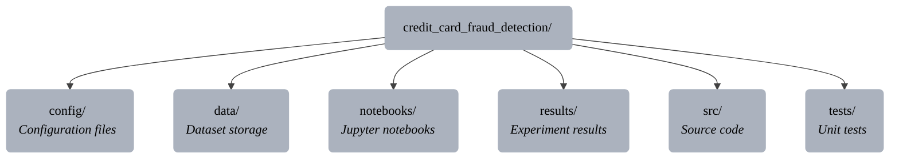
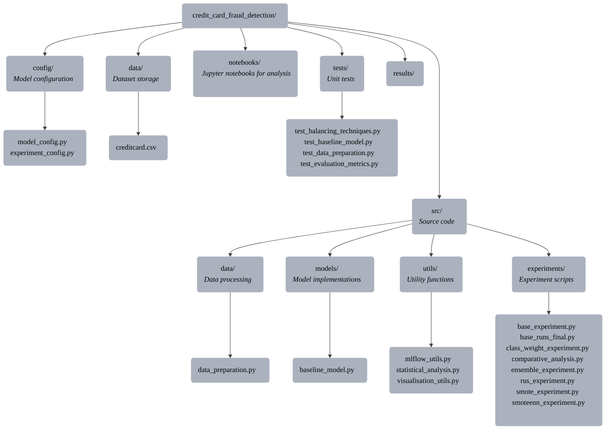
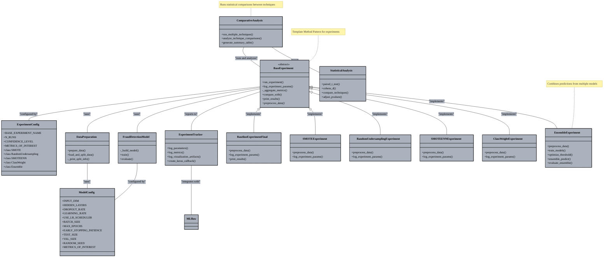
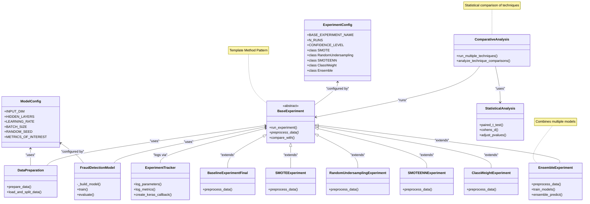
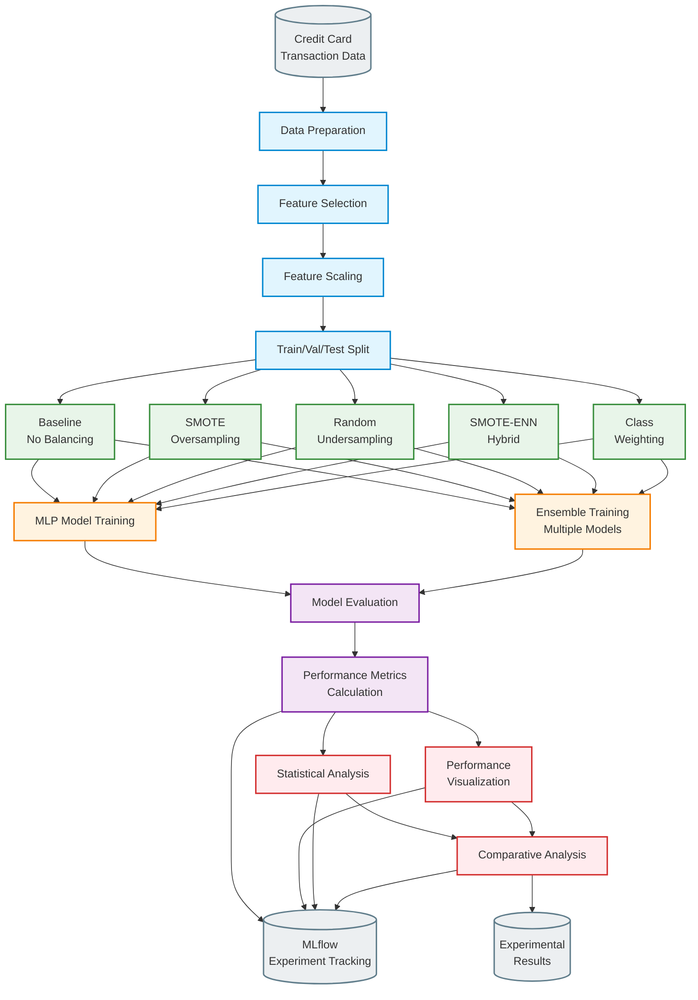
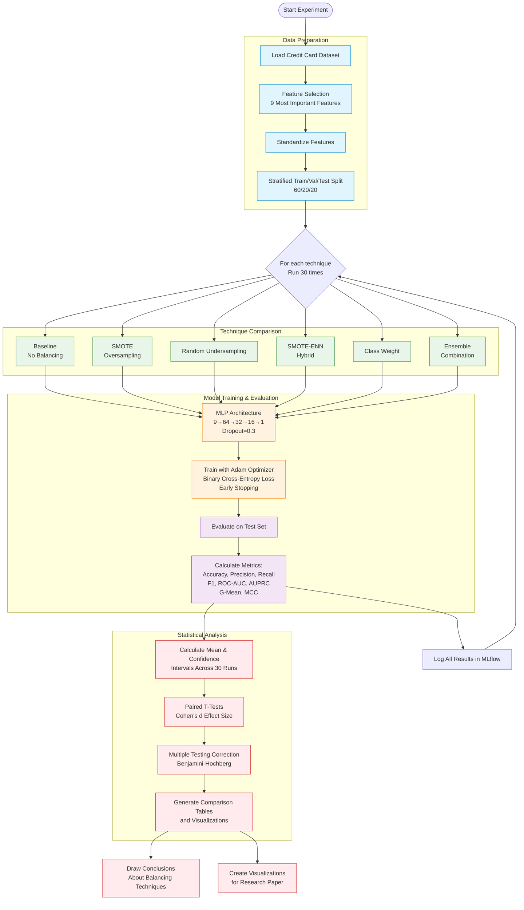

# Diagrams
This document contains various diagrams created with mermaid.js

### High level project structure
The main directories and their purpose

  
______

### Detailed project structure

### Component diagram

  
  _____________

### Data flow diagram

### Experiment methodology
