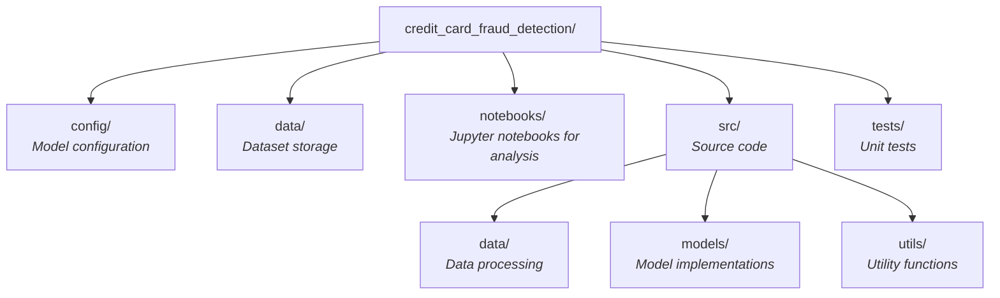

# Credit Card Fraud Detection with Deep Learning

This project explores techniques for handling class imbalanced data in deep learning models for credit card fraud detection. Using the European Credit Card dataset from 2013, we systematically compare different methods for addressing class imbalance and analyze their impact on model performance.

## Project Structure

