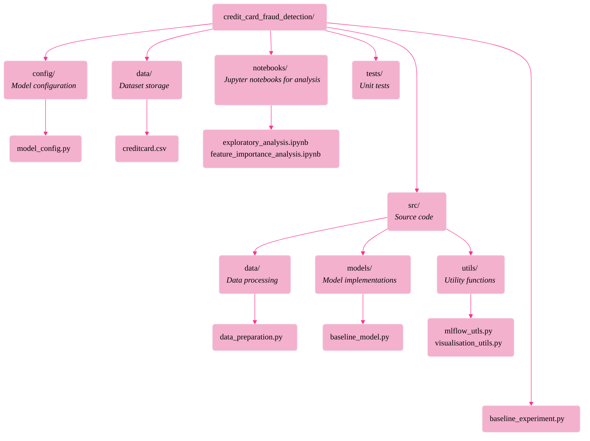

# Credit Card Fraud Detection with Deep Learning

This project explores techniques for handling class imbalanced data in deep learning models for credit card fraud detection. Using the European Credit Card dataset from 2013, we systematically compare different methods for addressing class imbalance and analyze their impact on model performance.

## Project Structure



# Data Preparation Module Documentation

## Overview
This module handles the loading and preprocessing of credit card transaction data for fraud detection. It includes standardization of features and creation of train/validation/test splits while preserving class distribution.

## Class: DataPreparation

### Description
A class that encapsulates data loading, scaling, and splitting functionality with configurable random seed for reproducibility.

### Constructor Parameters
- `random_state` (int, optional): Seed for random number generation. If not provided, uses value from ModelConfig.RANDOM_SEED

### Methods

#### prepare_data(data_path)
Loads and preprocesses the credit card transaction dataset.

##### Arguments
- `data_path` (str): Path to the creditcard.csv file

##### Returns
Dictionary containing the following numpy arrays:
- `X_train`: Training features
- `X_val`: Validation features  
- `X_test`: Test features
- `y_train`: Training labels
- `y_val`: Validation labels
- `y_test`: Test labels

##### Processing Steps
1. Loads data from CSV file
2. Selects relevant features (V1-V28 and Amount)
3. Separates features (X) and target variable (y)
4. Scales features using StandardScaler
5. Creates stratified train/validation/test splits
6. Reshapes target variables for model compatibility

### Key Features
- StandardScaler for feature normalization
- Stratified splitting to maintain fraud/non-fraud ratio
- Two-step split process (train/val/test)
- Detailed logging of data split information
- Target variable reshaping for deep learning compatibility

### Dependencies
- pandas
- numpy
- scikit-learn
- model_config (local configuration)

### Example Usage
```python
# Initialize data preparation
data_prep = DataPreparation(random_state=42)

# Prepare the data
data = data_prep.prepare_data('path/to/creditcard.csv')

# Access the splits
X_train = data['X_train']
y_train = data['y_train']
```

# Baseline Fraud Detection Model Documentation

## Overview
This module implements a baseline deep neural network for credit card fraud detection using TensorFlow/Keras. The model uses a multilayer perceptron (MLP) architecture with dropout layers for regularization and includes comprehensive experiment tracking via MLflow.

## Class: FraudDetectionModel

### Description
Implements a neural network with three hidden layers for binary classification of credit card transactions as fraudulent or legitimate.

### Architecture
```
Input (29 features)
↓
Dense(64, ReLU) + Dropout
↓
Dense(32, ReLU) + Dropout
↓
Dense(16, ReLU) + Dropout
↓
Dense(1, Sigmoid)
```

### Methods

#### `__init__()`
Initializes the model using configurations from ModelConfig.

#### `_build_model()`
Constructs the neural network architecture.

##### Returns
- A compiled Keras Sequential model with:
  - Binary cross-entropy loss
  - Adam optimizer
  - Multiple evaluation metrics (accuracy, precision, recall, AUC)

#### `train(X_train, y_train, X_val, y_val, experiment_name="baseline_model")`
Trains the model with experiment tracking.

##### Arguments
- `X_train`: Training features
- `y_train`: Training labels
- `X_val`: Validation features
- `y_val`: Validation labels
- `experiment_name`: Name for MLflow experiment tracking

##### Features
- Early stopping with best weights restoration
- MLflow experiment tracking
- Parameter logging
- Training history tracking

#### `evaluate(X_test, y_test)`
Evaluates model performance on test data.

##### Arguments
- `X_test`: Test features
- `y_test`: Test labels

##### Returns
Dictionary containing evaluation metrics:
- Accuracy
- Precision
- Recall
- F1 Score
- Confusion matrix components (TP, TN, FP, FN)

### Key Features
- Dropout regularization for preventing overfitting
- Early stopping to prevent overtraining
- Comprehensive metric tracking
- MLflow integration for experiment monitoring
- Detailed evaluation reporting

### Dependencies
- TensorFlow
- MLflow
- scikit-learn
- numpy
- model_config (local configuration)

### Example Usage
```python
# Initialize model
model = FraudDetectionModel()

# Train model
history = model.train(X_train, y_train, X_val, y_val)

# Evaluate model
metrics = model.evaluate(X_test, y_test)
```

# MLflow Experiment Tracking Utilities Documentation

## Overview
This module provides a context manager-based wrapper for MLflow experiment tracking functionality, simplifying the process of logging machine learning experiments, particularly for TensorFlow/Keras models.

## Class: ExperimentTracker

### Description
A context manager class that handles MLflow experiment runs, parameter logging, and metric tracking with specific support for Keras training.

### Constructor Parameters
- `experiment_name` (str): Name of the experiment for MLflow tracking

### Methods

#### `log_parameters(params: Dict[str, Any])`
Logs multiple parameters to MLflow.

##### Arguments
- `params`: Dictionary containing parameter names and values to log

#### `log_metrics(metrics: Dict[str, float], step: int = None)`
Logs multiple metrics to MLflow.

##### Arguments
- `metrics`: Dictionary containing metric names and values
- `step`: Optional step number for the metrics (e.g., epoch number)

#### `create_keras_callback()`
Creates a Keras callback for automatic metric logging during model training.

##### Returns
- A custom Keras callback class that logs training metrics at the end of each epoch

#### Context Manager Methods

##### `__enter__()`
Starts an MLflow run when entering the context.

##### `__exit__(exc_type, exc_val, exc_tb)`
Ends the MLflow run when exiting the context.

### Features
- Context manager interface for clean experiment management
- Automatic logging of Keras training metrics
- Batch parameter and metric logging
- Integration with TensorFlow/Keras training loops

### Dependencies
- mlflow
- tensorflow
- typing (for type hints)

### Example Usage
```python
# Basic usage
with ExperimentTracker("experiment_name") as tracker:
    # Log parameters
    tracker.log_parameters({
        "learning_rate": 0.001,
        "batch_size": 32
    })
    
    # Log metrics
    tracker.log_metrics({
        "accuracy": 0.95,
        "loss": 0.1
    })

# Usage with Keras model
model = keras.Sequential(...)
callbacks = [tracker.create_keras_callback()]
model.fit(..., callbacks=callbacks)

